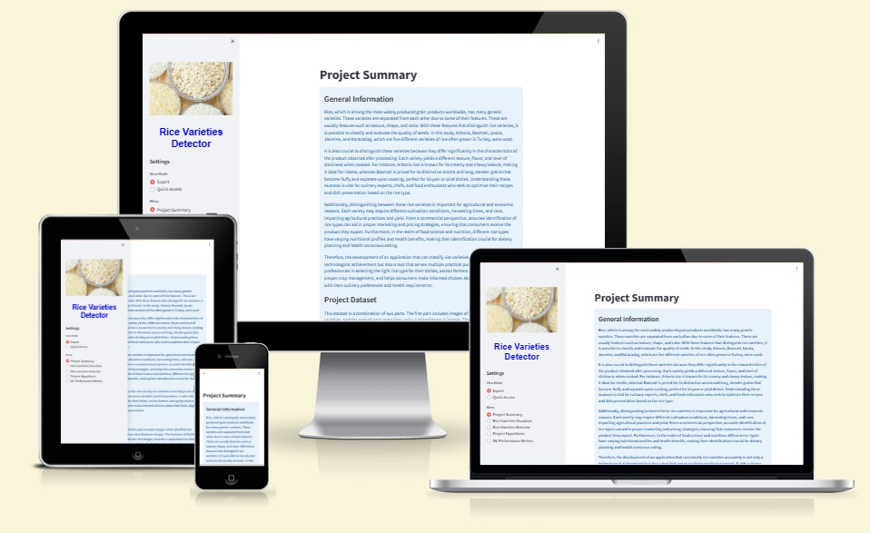  

[Link to live project](https://rice-varieties-detector-b3b52f0488ad.herokuapp.com/)

## Table of Contents
1. [Dataset Content](#dataset-content)
2. [Business Requirements](#business-requirements)
3. [Hypothesis and validation](#hypothesis-and-validation)
4. [Rationale for the model](#rationale-for-the-model)
5. [Trial and error](#trial-and-error)
6. [Implementation of the Business Requirements (User Expierence)](#the-rationale-to-map-the-business-requirements-to-the-data-visualizations-and-ml-tasks)
7. [ML Business case](#ml-business-case)
8. [Dashboard design](#dashboard-design-streamlit-app-user-interface)
9. [CRISP DM Process](#the-process-of-cross-industry-standard-process-for-data-mining)
10. [Bugs](#bugs)
11. [Model Testing](#model-testing)
12. [Deployment](#deployment)
13. [Development](#development)
14. [Technologies used](#technologies-used)
15. [Project Improvement Opportunities](#project-improvement-opportunities)
16. [Development History](##development-history-of-the-educational-project-developing-and-deploying-an-ai-system)
17. [Aknowlegments](#acknowledgments)

# Rice varieties detector

## Dataset Content

**Dataset Overview**  

The dataset for this project is a composite of two distinct datasets, each serving a specific purpose in the development and training of the machine learning model.

**Rice Varieties Dataset**  

The first dataset consists of grain images of five popular rice varieties commonly grown in Turkey: Arborio, Basmati, Ipsala, Jasmine, and Karacadag. It comprises a total of 75,000 grain images, with 15,000 images for each variety. All images are unified and in JPG format.

[The Rice Image dataset](https://www.kaggle.com/datasets/muratkokludataset/rice-image-dataset/data) is available under the CC0: Public Domain License.

**Non-Rice Images Dataset**  

The second dataset is curated to train the model on non-rice images. It consists of a variety of images scraped from Google and other open-source data sources, including contributions from MIT and Kaggle. The dataset contains more than 35K images of different sizes in JPG, PNG, JPEG and P formats. The dataset requires a lot of preprocessing. This dataset is instrumental in teaching the model to differentiate rice grain images from unrelated visuals, thereby enhancing its ability to handle real-world scenarios where non-rice images might be encountered.

The non-rice images fall into four categories: Art & Culture, Architecture, Food and Drinks, Travel and Adventure. The dataset continues to evolve, with updates and expansions planned over time.

[Google Scraped Image Dataset](https://www.kaggle.com/datasets/duttadebadri/image-classification?select=test) is also available under the CC0: Public Domain License.

All images have been uniformly processed and resized, then divided into three subsets for training, validation, and testing the model.

## Business Requirements
Our client, a leading agricultural company specializing in rice production, has approached us with a unique challenge. They require a Machine Learning (ML) based solution to accurately classify rice grains into five specific varieties: Arborio, Basmati, Ipsala, Jasmine, and Karacadag. The need for this technology stems from the fact that these rice varieties, while visually similar, have significant differences in cooking properties and market value. Accurate classification is crucial for maintaining the quality and reputation of their products.  Here you can familiarize yourself with the full [business interview](https://github.com/1101712/Rice-Detector/wiki/Business-understanding-interview)

**Summarizing**:  

 1. The client is keen on conducting an in-depth analysis to visually differentiate between the five rice varieties. This involves identifying unique features of each variety through machine learning techniques.  

2. The primary goal is to develop an ML model capable of determining the specific variety of rice depicted in uploaded images. This model should be highly accurate (over 95%) and efficient, given the close resemblance between the rice varieties.  

 3. Another essential requirement is the ability to generate detailed prediction reports. These reports will provide insights into the classification results for each uploaded image, aiding in quality control and product categorization.

4. Considering the vast amount of rice grains processed daily, the solution must be scalable and adaptable to handle large datasets without compromising accuracy or performance.

5. The client has emphasized the need for a user-friendly interface that allows for easy uploading of rice images and retrieval of prediction reports. 

## Hypothesis and validation
**Hypothesis 1**: Distinctive Features in Rice Varieties  

Hypothesis: On the images of five rice varieties (Arborio, Basmati, Ipsala, Jasmine, and Karacadag) provided for study by the client, distinct distinguishing features can be identified.

- How to Validate:  
To confirm this hypothesis, a thorough analysis of the rice varieties' images will be conducted. This will involve using image processing and deep learning techniques to identify unique features such as shape, size, texture, and color that differentiate each variety. Machine learning models will be trained and tested on these images to assess their ability to recognize and distinguish these features accurately.

**Hypothesis 2**: High Accuracy with Large Datasets and Deep Learning  

Hypothesis: With a sufficiently large dataset, the use of deep learning and carefully prepared data can achieve high accuracy (over 95%) in classifying the five rice varieties (Arborio, Basmati, Ipsala, Jasmine, and Karacadag) in images.

- How to Validate:  
This hypothesis will be validated by assembling a large dataset of images representing the five rice varieties. The dataset will undergo preprocessing to ensure optimal quality and uniformity. A deep learning model, specifically a Convolutional Neural Network (CNN), will then be trained on this dataset. The model's performance will be evaluated based on its accuracy in correctly classifying the images into the respective rice varieties. The goal is to achieve an accuracy rate of over 95%, demonstrating the effectiveness of deep learning in handling complex image classification tasks.

## Rationale for the model

This model is composed of 1 input layer, 3 convolutional layers (hidden layers), 1 fully connected hidden layer, and 1 output layer.

### Goal
The model's architecture, hyperparameters, and optimizer were chosen through experimentation and iterative refinement. This specific configuration, while not the only possible solution, was selected for its effective balance between accuracy and computational efficiency.

A well-designed model should generalize from training data to make accurate predictions on unseen data, avoiding overfitting. It should also be computationally efficient, minimizing the neural network's complexity without sacrificing performance.

### Model Architecture and Hyperparameters  

- Convolutional Layers (Hidden Layers):  
The model uses three 2D convolutional layers, appropriate for processing the 2D structure of the image data. These layers help in feature extraction by focusing on small segments of the input image.

- Kernel Size:  
A 3x3 convolutional kernel is chosen for its ability to capture essential features without overly narrowing the focus, thus maintaining a balance between detail and broader feature recognition.

- Number of Neurons:  
The neurons in each layer are set as powers of 2, optimizing computational efficiency and benefiting from GPU optimizations.

- Activation Function:  
The ReLU function is selected for its effectiveness in deep learning models. It helps to avoid the vanishing gradient problem and speeds up the training process.

- Pooling:  
MaxPooling is utilized to reduce the spatial dimensions of the output volume, thus reducing the number of parameters and computational load. This step is crucial for managing model complexity.

- Fully Connected Layer (Hidden Layer):  
This layer helps in making final classifications based on the features extracted by convolutional layers.

- Dropout Layer:  
Included to prevent overfitting by randomly setting a fraction of input units to zero during training.

### Model Compilation  

- Loss Function:  
Categorical cross-entropy is employed for this multi-class classification task.

- Optimizer:  
Adam optimizer is chosen for efficient handling of sparse gradients and adaptive learning rate adjustments.

- Metrics:  
Model performance is primarily assessed using accuracy as the metric.

### Training Process

- Data Augmentation:  
Used to increase the diversity of the training dataset. Parameters such as rotation, shifts, and mirroring help the model to learn from a wider range of image variations, which contributes to better generalization.

- Training and Validation Data Generators:  
Used for feeding data into the model during training. The validation dataset is not augmented, allowing a more accurate assessment of model performance on unmodified images.

- Batch Size:  
The choice of batch size affects the speed and stability of training. A smaller batch size can lead to more stable but slower convergence.  

- Step-by-step Prinziple:
The model is created to train step-by-step, one epoch at a time. This approach allows for saving the training history after each epoch. The saved history files named 'history_epoch_{epoch:02d}.csv' provide detailed insights into the model's performance across epochs, enabling a more thorough manual analysis to determine the most effective model.  
This decision was made after the model with the highest validation accuracy was automatically saved, which turned out not to be the most effective in terms of balancing all parameters. The better model had a validation accuracy that was only 0.01 lower, but it clearly outperformed the automatically saved model in other metrics.

### Early Stopping and Checkpointing

- Early Stopping:  
Used to prevent overfitting. Training is halted if accuracy on the validation dataset does not improve for a set number of epochs. This helps to preserve the model at the point where it achieves an optimal balance between learning and generalization.

- Model Checkpointing:  
Allows saving the model after each epoch. This offers the possibility to restore the model at any stage of training and analyze its performance at different times.

## Trial and error  

### Evolution of the Model  

**Version 1: Initial Approach**  

The first iteration of our model, Version 1, focused on developing a basic understanding of machine learning and model training. The model saved the best version based on the highest validation accuracy. At this stage, my understanding of versioning and documentation was still developing, which led to somewhat scattered documentation. The primary objective was to establish a foundational model and learn from its performance.

**Version 2: Refinement and Expansion**  

Building on the first model, Version 2 was implemented with updates and enhancements. This version involved reorganizing and saving some files in new directories, and documenting the outcomes in separate folders. The significant learning from this iteration was the realization of a critical flaw: the model incorrectly classified all non-target images (those not among the five specified rice varieties) into one of the target categories, often with high confidence (a phenomenon sometimes termed overconfidence in model predictions). This limitation necessitated a rethink of our approach.

**Version 3: Introduction of Negative Class and Further Improvements**  

Recognizing the need to accurately classify non-target images, we introduced a 'negative class' to train the model in distinguishing non-rice images from the five target rice varieties. This version had dedicated directories (jupyter_notebook_v3, Inputs_v3, and outputs_v3), all included in the .gitignore file for efficient version control. Upon achieving satisfactory results with this updated model, we decided to remove the initial inputs and outputs directories, as the processes could be replicated using the code if needed. The outputs folder was also removed for space efficiency, while documentation and checks for the second version were retained for reference.

**Key Metrics and Visualizations**  

ROC Curve: This graph represented the Receiver Operating Characteristic (ROC) curves for each class, providing insights into the model's ability to distinguish between the target rice varieties and the negative class.

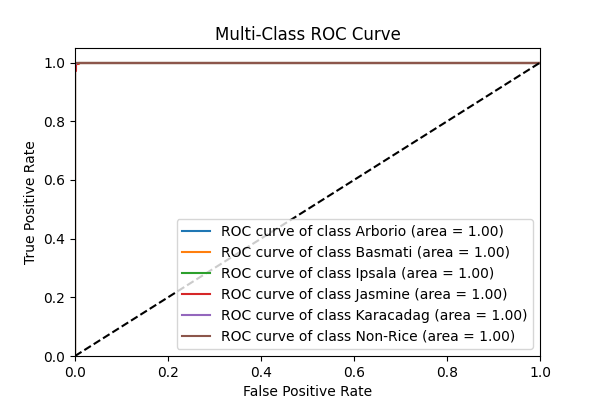

**Loss and Accuracy Over Epochs**:  

This chart showcased the model's training and validation loss and accuracy over various epochs, illustrating the learning progress and stability of the model.  

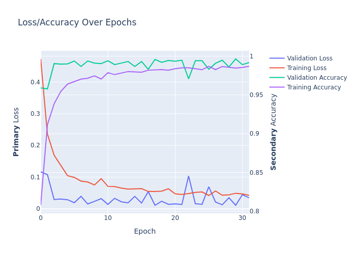
## The rationale to map the business requirements to the Data Visualizations and ML tasks  

The five main business requirements were split in several user stories which were translated in Machine Learning Tasks.  For a more detailed exploration of the user stories and their associated tasks and acceptance criteria see [GitHub project](https://github.com/users/1101712/projects/8/views/1). 

All the tasks were manually tested and function as expected. 

## ML Business Case
For a comprehensive overview and detailed insights,please explore our Project Handbook on the  [Wiki](https://github.com/1101712/Rice-Detector/wiki/Rice-Varieties-Detector-Handbook).

### Rice Varieties Classifier  
Our goal is to develop an ML model that accurately classifies rice grains into one of five varieties – Arborio, Basmati, Ipsala, Jasmine, and Karacadag – based on an extensive image dataset. This project is a classic case of supervised learning, framed as a multi-class, single-label classification challenge.

The ideal outcome of this project is to provide an efficient and reliable tool for accurate rice variety identification, which is crucial for quality control in the agricultural and food industries.

The success metrics for our model include:

An accuracy rate exceeding 95% on the test dataset.
The model output is designed to classify the rice variety and provide the associated probability for each classification. Users can upload rice grain images to the application, with instant, on-the-spot predictions.
Heuristics: Traditional methods of rice variety identification rely on manual inspection, which can be time-consuming and subject to human error. This project aims to automate and enhance the accuracy of this process.

The training data for the model are sourced from a curated dataset of rice grain images, encompassing a wide variety of rice types and characteristics. This dataset is critical for training the model to recognize and differentiate between the specified rice varieties accurately.

## Dashboard Design (Streamlit App User Interface)

### Dashboard Menu:  

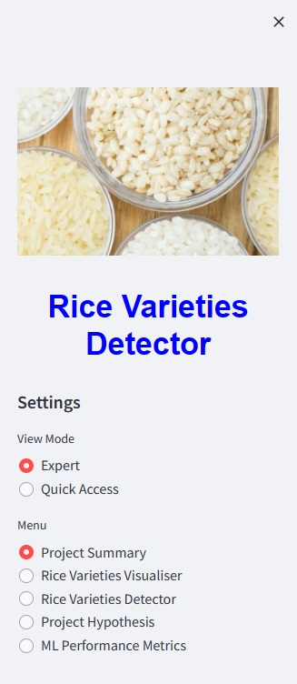

- Header Image: A visual representation related to rice varieties, placed at the top of the sidebar to set the thematic tone for the application.  

- Menu Title: "Rice Varieties Detector" displayed prominently as a header in the sidebar, introducing the name and purpose of the application.  

- Settings Section: Contains a "View Mode" selector that offers two viewing options for users:
    - Expert Mode: Grants access to the full range of application pages, enabling in-depth exploration and interaction.
    - Quick Access Mode: Limits the display to essential pages, such as "Rice Varieties Detector" and "Project Summary," for a more streamlined non-expert user experience.  

- Menu: Presents a list of navigable pages within the application.

### Main Pages of the Dashboard:  
 
1. **Project Summary Page**:  

- General Information: Provides an overview of the project, including the significance of differentiating rice varieties and their culinary, agricultural, and economic importance.  
- Project Dataset: Details the dataset used, including the total number of images and distribution among the five rice varieties and non-rice images.
- Business Requirements: Outlines the key business requunderstanding algorithms and data structures.  

2. **Rice Varieties Visualizer Page**:

- Introduction: Describes the purpose of the visualizer and its role in the project.  
- Average and Variability: Interactive section with checkboxes to display the average and variability images for each rice variety and non-rice images.  
- Image Montage: Another interactive section with checkboxes to display a montage of images for each rice variety and non-rice images.  
- Additional Information: Link to the Project README file.  

3. **Rice Varieties Detector Page**:   

The Rice Varieties Detector page has following functionalities for a more robust user experiences:

- **Image Upload Guidance**:  
A clear image of an individual rice grain should be uploaded.
The grain must be centered and occupy a significant portion of the image, akin to the provided reference image.  
Only a maximum of 4 images are permitted for upload at any given time.   

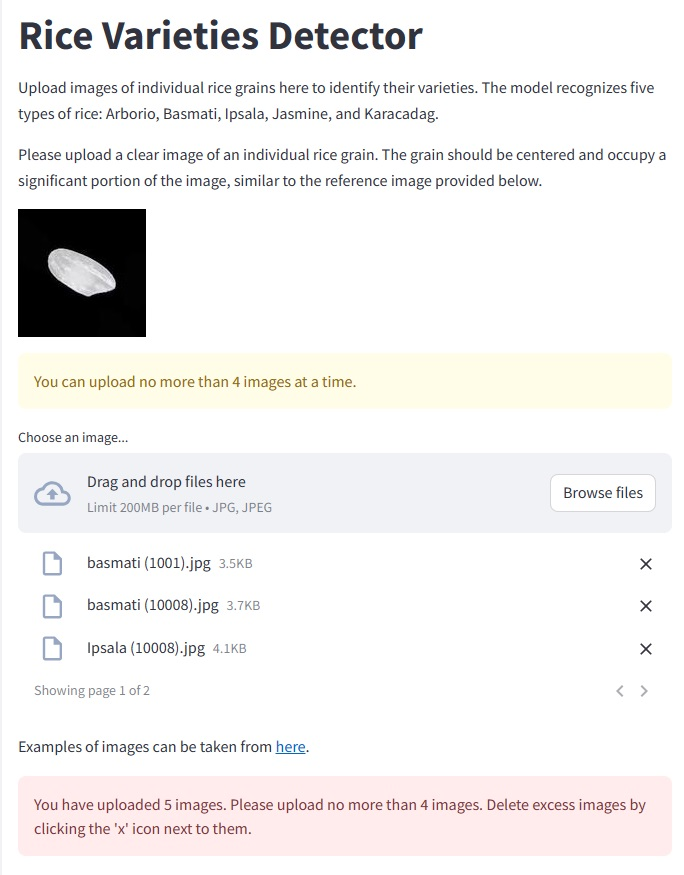

- **Model Predictions**  
The model can recognize five rice varieties: Arborio, Basmati, Ipsala, Jasmine, and Karacadag, as well as images that cannot be confidently classified as any of these rice variants. For images that are not identified as one of these varieties, the model will display a message advising the user to ensure image clarity and focus. For images that the model identifies with less than 85% confidence, a message will be displayed advising the user that due to low model confidence, the image cannot be confidently classified as any of the target rice variants. The model will categorize such images as non-rice and prompt the user accordingly.  
Prediction results for images above the confidence threshold will display the rice variety and probability immediately after processing.

- **Non-Rice Image Handling**  

When the model evaluates an image, it calculates the probability that the image belongs to one of the known rice varieties. If the predicted probability is lower than 85%, the model treats the image as 'Non-Rice or Unclear' due to low confidence in the prediction. In this case, as well as when the model explicitly identifies an image as non-rice, the application will flag the image accordingly and record 'Non-Rice or Unclear' with a probability of 'N/A' in the predictions CSV file. 

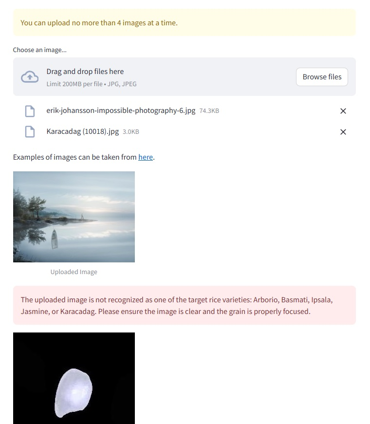

---  

- **Downloadable Predictions**  
Users have the option to download the predictions in a CSV file format, providing a record of the model's classifications for future reference or analysis.  

In the Streamlit code, when predictions are saved to a file named predictions.csv, each subsequent call to the save_predictions() function overwrites the previous file with the same name. This occurs because the same filename is used repeatedly for saving predictions. Therefore, there's no significant memory burden on the server from storing multiple files.  

By handling a large number of requests, since each set of predictions is overwritten by the next, the server does not store a growing number of files, which helps manage memory usage efficiently. However, this also means that each user's predictions are only temporarily available and are replaced when new predictions are made. For high-traffic applications, this approach ensures the server is not overwhelmed with storing numerous files, but it also limits the persistence of each prediction set.  

If long-term storage or tracking of each prediction set is necessary, implementing a system for saving each file with a unique identifier. This would allow individual prediction sets to be retained and accessed as needed, though it could lead to increased storage requirements over time.

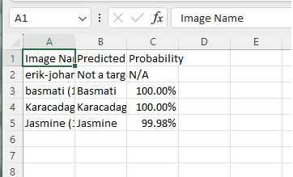

- **Reference Image**  
A sample image demonstrating the ideal positioning and sizing of the rice grain for analysis is displayed on the page to guide users in capturing or selecting appropriate images for upload.  

- **Link to Example Dataset**  
A hyperlink to a Kaggle dataset is provided, where users can find example images for reference or testing purposes.

- **Implementation Details**  
The model is loaded from the specified path, and each uploaded image is processed and classified in real-time.  
Predictions and their respective probabilities are dynamically generated and displayed alongside the uploaded images.  
The results are appended to an array that is later used to generate a downloadable CSV file, enhancing the interactive nature of the application.  

4. **Project Hypothesis Page**:    

- Hypothesis 1 and Validation: Discusses the first hypothesis about identifying distinct features of rice varieties and its validation.  
- Hypothesis 2 and Validation: Discusses the second hypothesis regarding achieving high accuracy with a large dataset and deep learning, including model validation.  
- Visualizations: Includes Confusion Matrix, Classification Report, and ROC Curve with brief explanations of each.  
- Additional Information: Link to the Project README file.  

5. **Machine Learning Performance Metrics Page**:  

- Dataset Percentage Distribution: Pie chart showing the distribution of the dataset into training, validation, and test sets.
- Label Frequencies: Bar chart showing the distribution of labels in the train, validation, and test sets.
- Color Distribution: Histograms showing color distribution across rice varieties.
- Model Accuracy Over Epochs: Line chart tracking the model's accuracy and loss over epochs, with explanatory text.
- Additional Visualizations: Reference to the Project Hypothesis page for more detailed performance visualizations.
- More Information: Link to the Project README file for comprehensive project details.

## CRISP DM Process
**The process of Cross-industry standard process for data mining**  

The Cross-Industry Standard Process for Data Mining (CRISP-DM) is a well-established data mining process model that describes common approaches used by data mining experts. It is a data mining methodology and process model that provides a structured approach to planning a data mining project. It is widely used, straightforward, and it features the best practices in this field.  

1. Business Understanding:

- Determine business objectives: The primary goal was to develop a model that could accurately classify different varieties of rice based on image data.  
- Assess the situation: Understanding the need for accurate classification to aid in various applications, such as culinary uses and agricultural sorting.  
- Determine data mining goals: To create a predictive model that can classify rice varieties with high accuracy.  
- Produce a project plan: Plan the development stages, including data acquisition, model training, evaluation, and deployment.  

2. Data Understanding:

- Collect initial data: Gathered a dataset composed of images of different rice varieties and non-rice images.
- Describe data: The dataset includes 75,000 images of five rice varieties and a separate dataset 35,000 images for non-rice objects.
- Explore data: Analyze the datasets to understand the characteristics of the rice varieties and the non-rice objects.
- Verify data quality: Ensure the images are clear and suitable for building a reliable classification model.  

3. Data Preparation:

- Select data: Choose relevant features from the image data for model training.
- Clean data: Process the images to ensure uniformity and quality, removing any corrupt or irrelevant images, and reducing the volume of data to 5,000 for each category of rice varieties and non-rice images to balance the dataset.
- Construct data: Augment the dataset if necessary to improve model robustness.
Integrate data: Combine various sources of data to create a comprehensive training set.
- Format data: Resize and format images to fit the input requirements of the machine learning model.  

4. Modeling:

- Select modeling techniques: Choose appropriate deep learning models for image classification tasks.  
- Design test: Outline the training and validation process, including cross-validation strategies.  
- Build model: Train models using the processed datasets, tuning parameters as needed.  
- Assess model: Evaluate the models using accuracy, precision, recall, and other relevant metrics.  

5. Evaluation:

- Evaluate results: Check the degree to which the model meets the business objectives.  
- Review process: Assess the execution of the data mining project to identify any deviations from the plan.  
- Determine next steps: Decide on the course of action—whether to proceed to deployment, iterate further, or initiate new data mining processes.  

6. Deployment:

- Plan deployment: Create a strategy for deploying the model into a production environment.  
- Plan monitoring and maintenance: Establish a system for regular model assessments and updates.  
- Produce final report: Document the project outcomes, learnings, and recommendations.  
- Review project: Reflect on what was done, what could be improved, and what lessons were learned.  

## Bugs

### Fixed Bugs

In the course of the project, a critical bug was identified where the model consistently misclassified non-rice images as one of the rice varieties, often with a 100% probability. This high level of misplaced confidence made it impossible to rectify the issue through code-based probability thresholds, necessitating a fundamental retraining of the model to discern non-rice images more accurately. To address this issue, a third version of the model was developed that included a negative class, specifically designed to recognize and classify non-rice images accurately.  
Despite this improvement, there were still instances where the model predicted non-rice images as a rice variety with low confidence. This was particularly prevalent with images that bore a resemblance to rice but were not part of the target classes. 

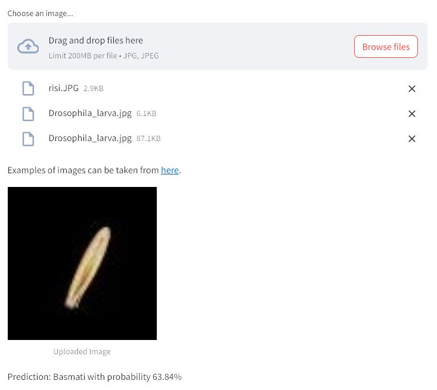  

To resolve this persisting bug, an additional logic was implemented in the prediction process. Now, any image that the model classifies as a rice variety with less than 85% confidence is conservatively categorized as non-rice. Users are informed with a carefully phrased message indicating the model's low confidence, suggesting that the image is likely not one of the target rice varieties.  

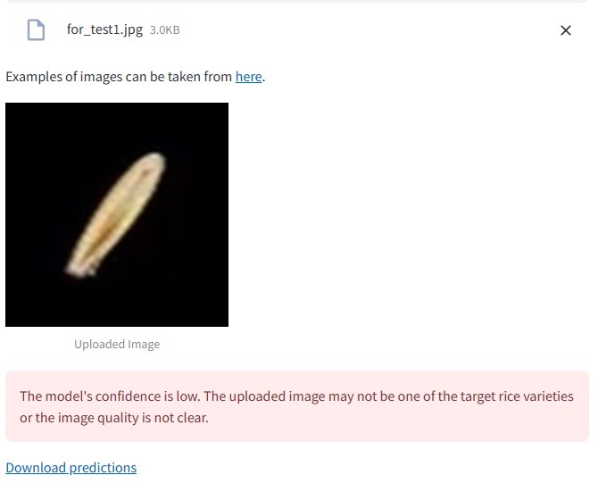  

### Unfixed Bugs

Despite the improvements made, there are occasions when the model still produces false-positive predictions with 100% certainty for extraneous images that do not belong to the target rice varieties. This is exemplified by the specially selected test image of the moon, which bears a resemblance to one of the average images of the rice varieties. (Here you would insert the image).  

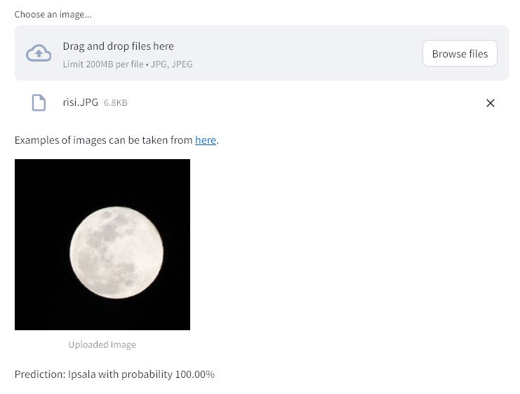  

Credit must be given to the model, the moon does indeed look very appetizing. 😉  

**Resolution**:  
The model requires further training with an expanded negative class that includes images resembling rice grains, particularly those that mimic the average images of the target rice varieties. The goal is to enhance the model's discriminatory capacity and reduce the likelihood of such false-positive high-confidence predictions.  

## Model Testing  

For testing purposes, the model was evaluated using specially taken photographs of rice grains, some of known varieties and others of unknown types. For images of rice grains with known varieties, the model provided accurate predictions with over 90% confidence. Additionally, the model was tested with images sourced from the internet that resembled rice grains. In the vast majority of these cases, the model correctly classified them as non-rice, except for the exceptions mentioned in the [Bugs](#bugs) section above.  

The model was also put to the test with completely unrelated images, bearing no resemblance to rice grains. In these scenarios, the model demonstrated absolute accuracy, consistently identifying them as non-rice without any errors. 

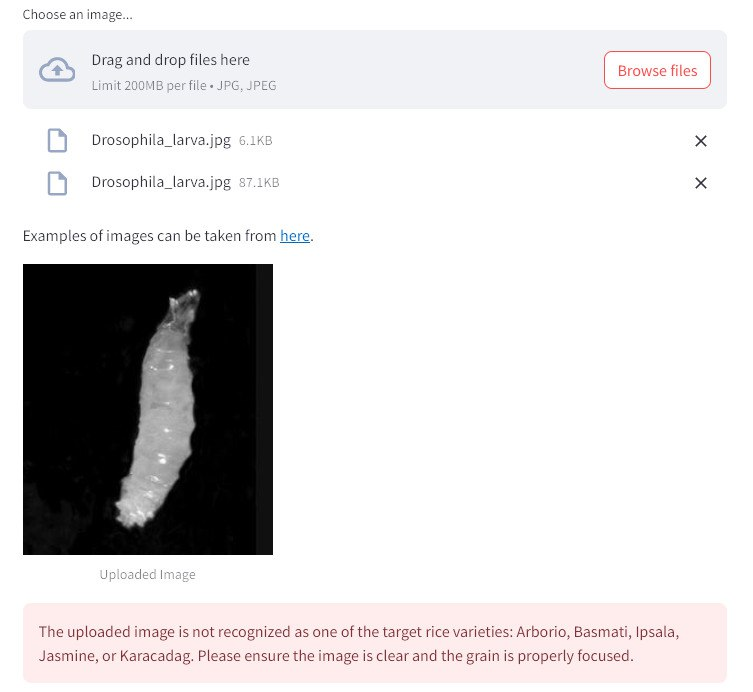

## Deployment
The project is coded and hosted on GitHub and deployed with [Heroku](https://rice-varieties-detector-b3b52f0488ad.herokuapp.com/). 

### Creating the Heroku app 
The steps needed to deploy this projects are as follows:

1. Create a `requirement.txt` file in GitHub, for Heroku to read, listing the dependencies the program needs in order to run.
2. Set the `runtime.txt` Python version to a Heroku-20 stack currently supported version.
3. `push` the recent changes to GitHub and go to your [Heroku account page](https://id.heroku.com/login) to create and deploy the app running the project. 
3. Chose "CREATE NEW APP", give it a unique name, and select a geographical region. 
4. Add  `heroku/python` buildpack from the _Settings_ tab.
5. From the _Deploy_ tab, chose GitHub as deployment method, connect to GitHub and select the project's repository. 
6. Select the branch you want to deploy, then click Deploy Branch.
7. Click to "Enable Automatic Deploys " or chose to "Deploy Branch" from the _Manual Deploy_ section. 
8. Wait for the logs to run while the dependencies are installed and the app is being built.
9. The mock terminal is then ready and accessible from a link similar to `https://your-projects-name.herokuapp.com/`
10. If the slug size is too large then add large files not required for the app to the `.slugignore` file.

## Development

### Fork

- Locate the repository at this link [Rice-Detector](https://github.com/1101712/Rice-Detector).
- At the top of the repository, on the right side of the page, select "Fork" from the buttons available. 
- A copy of the repository is now created.

### Clone

To clone this repository follow the below steps: 

1. Locate the repository at this link [Rice-Detector](https://github.com/1101712/Rice-Detector). 
2. Under **'Code'**, see the different cloning options, HTTPS, SSH, and GitHub CLI. Click the prefered cloning option, and then copy the link provided. 
3. Open **Terminal**.
4. In Terminal, change the current working directory to the desired location of the cloned directory.
5. Type **'git clone'**, and then paste the URL copied from GitHub earlier. 
6. Type **'Enter'** to create the local clone. 
- Click [Here](https://help.github.com/en/github/creating-cloning-and-archiving-repositories/cloning-a-repository#cloning-a-repository-to-github-desktop) for a more detailed explanation.

### Download ZIP

- Log into GitHub and click on repository to download [Rice-Detector](https://github.com/1101712/Rice-Detector)
- Select **Code** and click "Download Zip" file
- Once download is completed, extract ZIP file and use in your local environment

## Technologies used

### Languages

- [Python](https://www.python.org/)
- [Markdown](https://en.wikipedia.org/wiki/Markdown)

### Frameworks - Libraries - Programs Used  

Python Libraries:

- [os](https://docs.python.org/3/library/os.html) -used for interacting with the operating system.
- [tensorflow-cpu](https://www.tensorflow.org) used for creating the model
- [numpy](https://numpy.org) used for converting to array
- [scikit-learn](https://scikit-learn.org/stable/index.html) used for evaluating the model  
- [pandas](https://pandas.pydata.org) used for creating/saving as dataframe  
- [matplotlib](https://matplotlib.org) used for plotting the sets' distribution  
- [keras](https://keras.io) used for setting model's hyperparamters  
- [plotly](https://plotly.com/python) used for plotting the model's learning curve  
- [seaborn](https://seaborn.pydata.org) used for plotting the model's confusion matrix  
- [streamlit](https://streamlit.io) used for creating and sharing this project's interface  
- [nbformat](https://nbformat.readthedocs.io/en/latest) used for reading, writing, and manipulating Jupyter Notebook files  
- [kaleido>=0.2.1](https://plotly.com/python/static-image-export/) used for generating static images from Plotly charts  
- [PIL (Pillow)](https://pillow.readthedocs.io/en/stable/) - Python Imaging Library for image manipulation
- [base64](https://docs.python.org/3/library/base64.html) used for encoding and decoding data in Base64 format, which is useful, for example, for creating encoded strings for downloading files over the web.
- [csv](https://docs.python.org/3/library/csv.html) used for working with CSV (Comma-Separated Values) files

They all are specifically designed to be used with the Python programming language. Considered Python libraries are commonly installed and managed through Python's package management system, such as pip.  

External Libraries and Packages:

- non External Libraries and Packages are used

### Frontend Technologies

- [Google Fonts](https://fonts.google.com/): Library of free fonts.

### Code Validation and Styling

- [PEP 8 Checker](https://pep8ci.herokuapp.com/): Online service for checking code adherence to PEP 8 standards.

### Design and Prototyping

- [ami.responsivedesign.is](http://ami.responsivedesign.is/): Tool for viewing your design on various devices.

### Development Tools, Deployment and Environments

- [Jupiter Notebook](https://jupyter.org/) to edit code for this project.  
- [GitHub](https://github.com/): Version control and code hosting platform.
- [GitPod](https://gitpod.io/): Online IDE for development.
- [Heroku](https://heroku.com/): Cloud platform for app hosting.

### Additional Tools

- [Markdown Live Preview](https://markdownlivepreview.com/): Online editor for Markdown file preview.
- [Guru99 on Web Testing](https://www.guru99.com/web-application-testing.html): Resource for manual web application testing guidelines.
- [Grammarly](https://www.grammarly.com/): Grammar and style checker.
- [Commit Message Generator](https://cbea.ms/git-commit/): Git commit message generator.
- [Chat GPT](https://openai.com/): Artificial intelligence for text generation.
- [Pythontutor](https://pythontutor.com/)

##  Source Credits

### Educational and Official Documentation

- [Real Python](https://realpython.com/): In-depth Python tutorials and articles.
- [GeeksforGeeks](https://www.geeksforgeeks.org/): Useful for 
- [FreeCodeCamp](https://www.freecodecamp.org/): Free coding bootcamp with interactive lessons.
- [LeetCode](https://leetcode.com/): For coding challenges and interview preparation.
- [Python Runtime Error](https://devcenter.heroku.com/articles/python-runtimes)
- [Streamlit documentation](https://docs.streamlit.io)
- [Kaggle Learn](https://www.kaggle.com/learn): A great resource for practical, hands-on learning in data science and machine learning, with interactive coding challenges and datasets.

### Community Support

- [Stack Overflow](https://stackoverflow.com/): Community support for code troubleshooting.

### Data and Research Resources

- [Pexels](https://www.pexels.com/): All imagery on the site was sourced from Pexels.com.
- [Kaggle](https://www.kaggle.com/) to download datasets for this project  

### Tutorials and Examples

- [Machine Learning for Everybody – Full Course](https://www.youtube.com/watch?v=i_LwzRVP7bg): youtube tutorial.  
- [Watching Neural Networks Learn](https://www.youtube.com/watch?v=TkwXa7Cvfr8) youtube video.  
- [How to use Learning Curves to Diagnose Machine Learning Model Performance](https://machinelearningmastery.com/learning-curves-for-diagnosing-machine-learning-model-performance/)  
- [Activation Functions Compared With Experiments](https://wandb.ai/shweta/Activation%20Functions/reports/Activation-Functions-Compared-With-Experiments--VmlldzoxMDQwOTQ)  
- [How to choose the size of the convolution filter or Kernel size for CNN?](https://medium.com/analytics-vidhya/how-to-choose-the-size-of-the-convolution-filter-or-kernel-size-for-cnn-86a55a1e2d15)  
- [The advantages of ReLu](https://stats.stackexchange.com/questions/126238/what-are-the-advantages-of-relu-over-sigmoid-function-in-deep-neural-networks#:~:text=The%20main%20reason%20why%20ReLu,deep%20network%20with%20sigmoid%20activation.)
- [Maxpooling vs minpooling vs average pooling](https://medium.com/@bdhuma/which-pooling-method-is-better-maxpooling-vs-minpooling-vs-average-pooling-95fb03f45a9#:~:text=Average%20pooling%20method%20smooths%20out,lighter%20pixels%20of%20the%20image.)  
- [How ReLU and Dropout Layers Work in CNNs](https://www.baeldung.com/cs/ml-relu-dropout-layers)  
- [Dense Layer vs convolutional layer](https://datascience.stackexchange.com/questions/85582/dense-layer-vs-convolutional-layer-when-to-use-them-and-how#:~:text=As%20known%2C%20the%20main%20difference,function%20based%20on%20every%20input.)  
- [7 tips to choose the best optimizer](https://towardsdatascience.com/7-tips-to-choose-the-best-optimizer-47bb9c1219e)  
- [Impact of Optimizers in Image Classifiers](https://towardsai.net/p/l/impact-of-optimizers-in-image-classifiers)  
- [Keras Accuracy Metrics](https://keras.io/api/metrics/accuracy_metrics/#:~:text=metrics.,with%20which%20y_pred%20matches%20y_true%20.)  

  
### Projects and Repositories

- [Code Institute](https://codeinstitute.net/ie/), [Code Institute - Churnometer Project](https://github.com/Code-Institute-Solutions/churnometer), [Code Institute -WalkthroughProject01](https://github.com/Code-Institute-Solutions/WalkthroughProject01).  

## Project Improvement Opportunities  

Despite the current success of the project, there are several ways to further enhance it:

Training on Images Similar to Rice but Not Rice. It is crucial to train the model to recognize images that look like rice but are not. This will help reduce the number of false recognitions.

Scalability for Large Data Volumes. The system needs to be capable of handling increased data volumes. This includes optimizing data storage and processing to ensure the model operates quickly and efficiently.

Applicability to Other Grain Types. Adapting the model for the classification of other grain types would be beneficial. This would make it more versatile and useful in various fields.

Continuous Updating and Improvement of the Model. To keep the model relevant, it should be regularly updated, taking into account new data and technologies. This will help it adapt to changes and improve its accuracy.  

Additionally, due to time constraints before the project deadline, the code was not perfectly formatted in accordance with PEP8 standards. Refactoring the code to align with these best practices remains on the list of future improvements. This step will not only enhance code readability and maintainability but also ensure better compliance with Python coding conventions.

## Development History of the Educational Project 'Developing and Deploying an AI System'

The journey of my educational project 'Developing and Deploying an AI System' began with an initial selection of a project based on the ["Factors Affecting Children Anemia Level"](https://www.kaggle.com/datasets/adeolaadesina/factors-affecting-children-anemia-level) dataset. Initially, it appeared promising, with some developers even creating machine learning models based on these data. However, the dataset posed significant challenges due to extensive missing and unclear data. After considerable effort, it became evident that the only significant correlation was between hemoglobin levels and anemia, which is a direct relationship and does not necessitate machine learning. I documented my progress and learnings at this stage and had to pivot to another project. Here is the link to the repository of [ChildrenAnemiaRisk Project](https://github.com/1101712/ChildrenAnemiaRisk) on GitHub.

My next endeavor involved image processing, a shift from my previous experience with tabular data. I chose the ["Potato Diseases Dataset"](https://www.kaggle.com/datasets/mukaffimoin/potato-diseases-datasets/data?select=Black+Scurf), which contained only 451 files, distributed across five types of potato diseases, healthy potatoes, and mixed images for testing. Despite efforts in data cleansing and model building, the dataset's limited size capped the model's accuracy below 80%. Attempts at changing the model architecture and augmenting data did not yield the desired improvements, leading to the decision to close the project. I documented the work up to that point and moved on to the next venture. Here is the link to the GitHub repository for [Potato-Diseases-Detector](https://github.com/1101712/Potato-Diseases-Detector) project.

The third attempt was with the ["Rice Image Dataset"](https://www.kaggle.com/datasets/muratkokludataset/rice-image-dataset/data), which I successfully completed. This dataset initially presented challenges due to its large size, complicating the GitHub commit process. I overcame this by randomly reducing the number of images. This project, although challenging, provided invaluable experience in a short period, contributing significantly to my learning curve in data science and AI system development.

## Acknowledgments
- To Kay Welfare, for providing great psyhological support and motivation.
- To Margarita Andrianova for helping to resolve the technical questions.
- I would like to mentions OpenAI's ChatGPT, which gave me a huge opportunity to study quickly and very efficiently.
- To the Code Institute Slack community.irements for the project.  
 