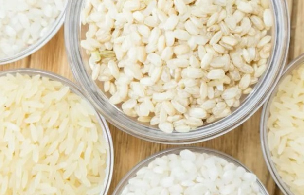

# Rice varieties detector
## Dataset Content
* Describe your dataset. Choose a dataset of reasonable size to avoid exceeding the repository's maximum size and to have a shorter model training time. If you are doing an image recognition project, we suggest you consider using an image shape that is 100px × 100px or 50px × 50px, to ensure the model meets the performance requirement but is smaller than 100Mb for a smoother push to GitHub. A reasonably sized image set is ~5000 images, but you can choose ~10000 lines for numeric or textual data. 

## Business Requirements
Our client, a leading agricultural company specializing in rice production, has approached us with a unique challenge. They require a Machine Learning (ML) based solution to accurately classify rice grains into five specific varieties: Arborio, Basmati, Ipsala, Jasmine, and Karacadag. The need for this technology stems from the fact that these rice varieties, while visually similar, have significant differences in cooking properties and market value. Accurate classification is crucial for maintaining the quality and reputation of their products.  Here you can familiarize yourself with the full [business interview](https://github.com/1101712/Rice-Detector/wiki/Business-understanding-interview)

Summarizing:  

 1. The client is keen on conducting an in-depth analysis to visually differentiate between the five rice varieties. This involves identifying unique features of each variety through machine learning techniques.  

2. The primary goal is to develop an ML model capable of determining the specific variety of rice depicted in uploaded images. This model should be highly accurate (over 95%) and efficient, given the close resemblance between the rice varieties.  

 3. Another essential requirement is the ability to generate detailed prediction reports. These reports will provide insights into the classification results for each uploaded image, aiding in quality control and product categorization.

4. Considering the vast amount of rice grains processed daily, the solution must be scalable and adaptable to handle large datasets without compromising accuracy or performance.

5. The client has emphasized the need for a user-friendly interface that allows for easy uploading of rice images and retrieval of prediction reports. 

## Hypothesis and validation
**Hypothesis 1**: Distinctive Features in Rice Varieties  

Hypothesis: On the images of five rice varieties (Arborio, Basmati, Ipsala, Jasmine, and Karacadag) provided for study by the client, distinct distinguishing features can be identified.

- How to Validate: To confirm this hypothesis, a thorough analysis of the rice varieties' images will be conducted. This will involve using image processing and deep learning techniques to identify unique features such as shape, size, texture, and color that differentiate each variety. Machine learning models will be trained and tested on these images to assess their ability to recognize and distinguish these features accurately.

**Hypothesis 2**: High Accuracy with Large Datasets and Deep Learning  

Hypothesis: With a sufficiently large dataset, the use of deep learning and carefully prepared data can achieve high accuracy (over 95%) in classifying the five rice varieties (Arborio, Basmati, Ipsala, Jasmine, and Karacadag) in images.

- How to Validate: This hypothesis will be validated by assembling a large dataset of images representing the five rice varieties. The dataset will undergo preprocessing to ensure optimal quality and uniformity. A deep learning model, specifically a Convolutional Neural Network (CNN), will then be trained on this dataset. The model's performance will be evaluated based on its accuracy in correctly classifying the images into the respective rice varieties. The goal is to achieve an accuracy rate of over 95%, demonstrating the effectiveness of deep learning in handling complex image classification tasks.

## The rationale to map the business requirements to the Data Visualizations and ML tasks
The five main business requirements were split in several user stories which were translated in Machine Learning Tasks.  For a more detailed exploration of the user stories and their associated tasks and acceptance criteria see [GitHub project](https://github.com/users/1101712/projects/8/views/1). 
All the tasks were manually tested and function as expected.

## ML Business Case
For a comprehensive overview and detailed insights,plwase explore our Project Handbook on the  [Wiki](https://github.com/1101712/Rice-Detector/wiki/Rice-Varieties-Detector-Handbook).

### Rice Varieties Classifier  
Our goal is to develop an ML model that accurately classifies rice grains into one of five varieties – Arborio, Basmati, Ipsala, Jasmine, and Karacadag – based on an extensive image dataset. This project is a classic case of supervised learning, framed as a multi-class, single-label classification challenge.

The ideal outcome of this project is to provide an efficient and reliable tool for accurate rice variety identification, which is crucial for quality control in the agricultural and food industries.

The success metrics for our model include:

An accuracy rate exceeding 95% on the test dataset.
The model output is designed to classify the rice variety and provide the associated probability for each classification. Users can upload rice grain images to the application, with instant, on-the-spot predictions.
Heuristics: Traditional methods of rice variety identification rely on manual inspection, which can be time-consuming and subject to human error. This project aims to automate and enhance the accuracy of this process.

The training data for the model are sourced from a curated dataset of rice grain images, encompassing a wide variety of rice types and characteristics. This dataset is critical for training the model to recognize and differentiate between the specified rice varieties accurately.

## Dashboard Design (Streamlit App User Interface)

### Dashboard Menu:  

1. **Navigation (Sidebar Navigation)**:

- Menu Title: Displayed as a header in the sidebar, for example, "Rice Varieties Detector".  
- Settings: Includes a "View Mode" option with two choices - "Standard" and "Quick Access".  
    - Standard Mode: Allows the user to view all available pages.  
    - Quick Access Mode: Displays only key pages such as "Rice Varieties Detector" and "Project Summary".  

2. **Page Selection**:  

- The user selects a page from the list in the sidebar.  
- The list of available pages depends on the selected viewing mode.  
- Selecting a page opens its corresponding content in the main panel.  

### Main Pages of the Dashboard:  
 
1. **Project Summary Page**:

- Title: "Project Summary".  
- General Information: Provides an overview of the project, including the significance of differentiating rice varieties and their culinary, agricultural, and economic importance.  
- Project Dataset: Details the dataset used, including the total number of images and distribution among the five rice varieties.
Business Requirements: Outlines the key business requirements for the project.  
- Additional Information: Link to the Project README file for further details.  

2. **Rice Varieties Visualizer Page**:

- Title: "Rice Varieties Visualizer".  
- Introduction: Describes the purpose of the visualizer and its role in the project.  
- Average and Variability: Interactive section with checkboxes to display the average and variability images for each rice variety.  
- Image Montage: Another interactive section with checkboxes to display a montage of images for each rice variety.  
- Additional Information: Link to the Project README file.  

3. **Rice Varieties Detector Page**:**  

- Title: "Rice Varieties Detector".  
- Introduction: Brief description of the detector's purpose.  
- Image Upload: File uploader widget allowing users to upload up to 4 images of rice grains.  
- Image Processing and Classification: Displays uploaded images and predicts the rice variety with associated probability.  
- Examples Link: Provides a link to a dataset for reference images.  

4. **Project Hypothesis Page**:  

- Title: "Project Hypothesis".  
- Hypothesis 1 and Validation: Discusses the first hypothesis about identifying distinct features of rice varieties and its validation.  
- Hypothesis 2 and Validation: Discusses the second hypothesis regarding achieving high accuracy with a large dataset and deep learning, including model validation.  
- Visualizations: Includes Confusion Matrix, Classification Report, and ROC Curve with brief explanations of each.  
- Additional Information: Link to the Project README file.  

5. **Machine Learning Performance Metrics Page**:  

- Title: "Machine Learning Performance Metrics".
- Dataset Percentage Distribution: Pie chart showing the distribution of the dataset into training, validation, and test sets.
- Label Frequencies: Bar chart showing the distribution of labels in the train, validation, and test sets.
- Color Distribution: Histograms showing color distribution across rice varieties.
- Model Accuracy Over Epochs: Line chart tracking the model's accuracy and loss over epochs, with explanatory text.
- Additional Visualizations: Reference to the Project Hypothesis page for more detailed performance visualizations.
- More Information: Link to the Project README file for comprehensive project details.

## Unfixed Bugs
* You will need to mention unfixed bugs and why they were not fixed. This section should include shortcomings of the frameworks or technologies used. Although time can be a significant variable to consider, paucity of time and difficulty understanding implementation is not a valid reason to leave bugs unfixed.

## Deployment
The project is coded and hosted on GitHub and deployed with [Heroku](https://www.heroku.com/). 

### Creating the Heroku app 
The steps needed to deploy this projects are as follows:

1. Create a `requirement.txt` file in GitHub, for Heroku to read, listing the dependencies the program needs in order to run.
2. Set the `runtime.txt` Python version to a Heroku-20 stack currently supported version.
3. `push` the recent changes to GitHub and go to your [Heroku account page](https://id.heroku.com/login) to create and deploy the app running the project. 
3. Chose "CREATE NEW APP", give it a unique name, and select a geographical region. 
4. Add  `heroku/python` buildpack from the _Settings_ tab.
5. From the _Deploy_ tab, chose GitHub as deployment method, connect to GitHub and select the project's repository. 
6. Select the branch you want to deploy, then click Deploy Branch.
7. Click to "Enable Automatic Deploys " or chose to "Deploy Branch" from the _Manual Deploy_ section. 
8. Wait for the logs to run while the dependencies are installed and the app is being built.
9. The mock terminal is then ready and accessible from a link similar to `https://your-projects-name.herokuapp.com/`
10. If the slug size is too large then add large files not required for the app to the `.slugignore` file.
   
## Development

### Fork

- Locate the repository at this link [Rice-Detector](https://github.com/1101712/Rice-Detector).
- At the top of the repository, on the right side of the page, select "Fork" from the buttons available. 
- A copy of the repository is now created.

### Clone

To clone this repository follow the below steps: 

1. Locate the repository at this link [Rice-Detector](https://github.com/1101712/Rice-Detector). 
2. Under **'Code'**, see the different cloning options, HTTPS, SSH, and GitHub CLI. Click the prefered cloning option, and then copy the link provided. 
3. Open **Terminal**.
4. In Terminal, change the current working directory to the desired location of the cloned directory.
5. Type **'git clone'**, and then paste the URL copied from GitHub earlier. 
6. Type **'Enter'** to create the local clone. 
- Click [Here](https://help.github.com/en/github/creating-cloning-and-archiving-repositories/cloning-a-repository#cloning-a-repository-to-github-desktop) for a more detailed explanation.

### Download ZIP

- Log into GitHub and click on repository to download [Rice-Detector](https://github.com/1101712/Rice-Detector)
- Select **Code** and click "Download Zip" file
- Once download is completed, extract ZIP file and use in your local environment

## Languages

- [Python](https://www.python.org/)
- [Markdown](https://en.wikipedia.org/wiki/Markdown)

## Frameworks - Libraries - Programs Used
### Python Libraries

- [os](https://docs.python.org/3/library/os.html) -used for interacting with the operating system.
- [tensorflow-cpu](https://www.tensorflow.org) used for creating the model
- [numpy](https://numpy.org) used for converting to array
- [scikit-learn](https://scikit-learn.org/stable/index.html) used for evaluating the model  
- [pandas](https://pandas.pydata.org) used for creating/saving as dataframe  
- [matplotlib](https://matplotlib.org) used for plotting the sets' distribution  
- [keras](https://keras.io) used for setting model's hyperparamters  
- [plotly](https://plotly.com/python) used for plotting the model's learning curve  
- [seaborn](https://seaborn.pydata.org) used for plotting the model's confusion matrix  
- [streamlit](https://streamlit.io) used for creating and sharing this project's interface  
- [nbformat](https://nbformat.readthedocs.io/en/latest) used for reading, writing, and manipulating Jupyter Notebook files  
- [kaleido>=0.2.1](https://plotly.com/python/static-image-export/) used for generating static images from Plotly charts  

They all are specifically designed to be used with the Python programming language and are commonly installed and managed through Python's package management system, such as pip.  

### External Libraries and Packages

- non External Libraries and Packages are used

### Frontend Technologies

- [Google Fonts](https://fonts.google.com/): Library of free fonts.

### Code Validation and Styling

- [PEP 8 Checker](https://pep8ci.herokuapp.com/): Online service for checking code adherence to PEP 8 standards.

### Design and Prototyping

- [ami.responsivedesign.is](http://ami.responsivedesign.is/): Tool for viewing your design on various devices.

### Development Tools, Deployment and Environments

- [Jupiter Notebook](https://jupyter.org/) to edit code for this project.  
- [GitHub](https://github.com/): Version control and code hosting platform.
- [GitPod](https://gitpod.io/): Online IDE for development.
- [Heroku](https://heroku.com/): Cloud platform for app hosting.

### Additional Tools

- [Markdown Live Preview](https://markdownlivepreview.com/): Online editor for Markdown file preview.
- [Guru99 on Web Testing](https://www.guru99.com/web-application-testing.html): Resource for manual web application testing guidelines.
- [Grammarly](https://www.grammarly.com/): Grammar and style checker.
- [Commit Message Generator](https://cbea.ms/git-commit/): Git commit message generator.
- [Chat GPT](https://openai.com/): Artificial intelligence for text generation.
- [Pythontutor](https://pythontutor.com/)

##  Source Credits

### Educational and Official Documentation

- [Real Python](https://realpython.com/): In-depth Python tutorials and articles.
- [GeeksforGeeks](https://www.geeksforgeeks.org/): Useful for understanding algorithms and data structures.
- [FreeCodeCamp](https://www.freecodecamp.org/): Free coding bootcamp with interactive lessons.
- [LeetCode](https://leetcode.com/): For coding challenges and interview preparation.
- [Python Runtime Error](https://devcenter.heroku.com/articles/python-runtimes)
- [Streamlit documentation](https://docs.streamlit.io)
- [Kaggle Learn](https://www.kaggle.com/learn): A great resource for practical, hands-on learning in data science and machine learning, with interactive coding challenges and datasets.

### Community Support

- [Stack Overflow](https://stackoverflow.com/): Community support for code troubleshooting.

### Data and Research Resources

- [Pexels](https://www.pexels.com/): All imagery on the site was sourced from Pexels.com.
- [Kaggle](https://www.kaggle.com/) to download datasets for this project  

### Tutorials and Examples

- [Machine Learning for Everybody – Full Course](https://www.youtube.com/watch?v=i_LwzRVP7bg): youtube tutorial.
- [Watching Neural Networks Learn](https://www.youtube.com/watch?v=TkwXa7Cvfr8) youtube video.
  
### Projects and Repositories

- [Code Institute](https://codeinstitute.net/ie/), [Code Institute - Churnometer Project](https://github.com/Code-Institute-Solutions/churnometer), [Code Institute -WalkthroughProject01](https://github.com/Code-Institute-Solutions/WalkthroughProject01).  

## Acknowledgments
- To Kay Welfare, for providing great psyhological support and motivation.
- To Margarita Andrianova for helping to resolve the technical questions.
- I would like to mentions Openais ChatGPT, which gave me a huge opportunity to study quickly and very efficiently.
- To the Code Institute Slack community.